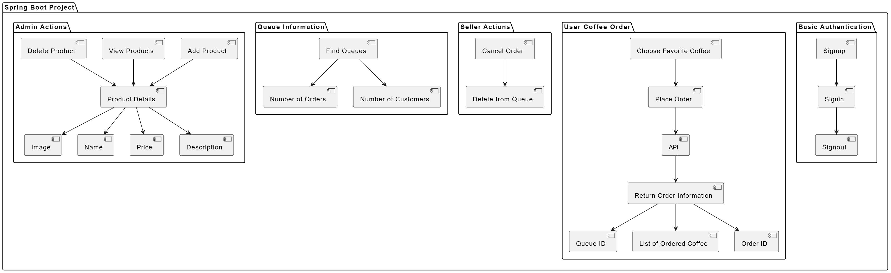
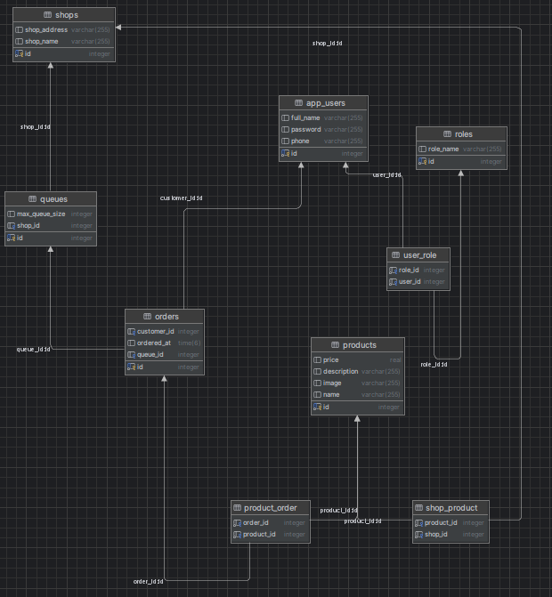

# Project overview

The Coffee Ordering System is a web-based application developed using Spring Boot, designed for the process of ordering coffee from a coffee shop. The system provides users with a convenient platform to place orders for their favorite coffee drinks, while also offering features for sellers and administrators to manage orders, products, and queues.

## Concept diagrams:

This project runs on Spring boot 3.2.3, includes APIs for following features:

1. Basic athentication (signup, signin and signout). 
2. User can place choost their favorite coffee and place order. API will return detail order information with queue id (for frontend to tell where user should go and get coffee), list of ordered coffee, and order id.
3. Seller can cancel order and delete it from queue.
4. Find queues with information how many orders (and customers) currently in this queue.
5. Admin can add more products (with image, name, price and description), as well as view and delete products.

## Database design:

## Technologies used:
- Implement a user authentication system using Spring Security.
  Security schema: Using DaoAuthenticationProvider with JWT token. Password encoder: BCryptPasswordEncoder
- Database: Spring Data JPA using PostgreSQL with Liquibase for database migration and data seeding.
- Liquibase: this project use Liquibase to set up database schema and mock initial data for review.
  It automatically creates all necessary tables during project startup (~11 tables) and insert some sample data
  The changelog files are in resources/db/changelog.
- Swagger for API documentation and testing.
- Dockerfile and docker compose: for deploy on AWS.

## Some use cases:

Actor: User
Description: A new user wants to create an account in the system.
Steps:
User navigates to the signup page.
User enters required information (username, email, password, etc.).
System validates the input data.
If validation passes, the system creates a new user account.
User receives a confirmation message upon successful signup.
User Signin:

Actor: User
Description: An existing user wants to sign in to the system.
Steps:
User navigates to the signin page.
User enters their credentials (username/email and password).
System validates the credentials.
If credentials are correct, the system generates a JWT token and returns it to the user.
User stores the token for subsequent authenticated requests.
Place Order:

Actor: User
Description: User wants to place an order for their favorite coffee.
Steps:
User selects the desired coffee(s) from the available options.
User confirms the order.
System validates the order and user authentication.
If valid, the system creates an order and adds it to the queue.
System returns detailed order information along with a queue ID to the user.
Cancel Order:

Actor: Seller
Description: Seller needs to cancel an order from the queue.
Steps:
Seller accesses the list of orders in the queue.
Seller selects the order they want to cancel.
System verifies the seller's authorization.
If authorized, the system removes the order from the queue.
System notifies the user about the cancellation.
View Queue Information:

Actor: Admin
Description: Admin wants to view the current queues with order and customer information.
Steps:
Admin accesses the queue management section.
Admin selects the queue they want to view.
System retrieves and displays the queue information, including the number of orders and customers in the queue.
Manage Products:

Actor: Admin
Description: Admin wants to add, view, or delete products from the system.
Steps:
Admin navigates to the product management section.
Admin selects the desired action (add, view, delete).
System performs the corresponding operation based on the admin's choice.
System updates the product catalog accordingly.
Admin receives confirmation of the performed action.

## How to run project:
- Run command: docker-compose up (at root of the project)
- Access swagger by this link: http://localhost:8080/swagger-ui/index.html
- In auth-controller group, login sample admin user:
- {
  "phone": "0912345678",
  "password": "123456"
  }
- It will return access token, paste the token in authorization box on the top to acess other APIs.